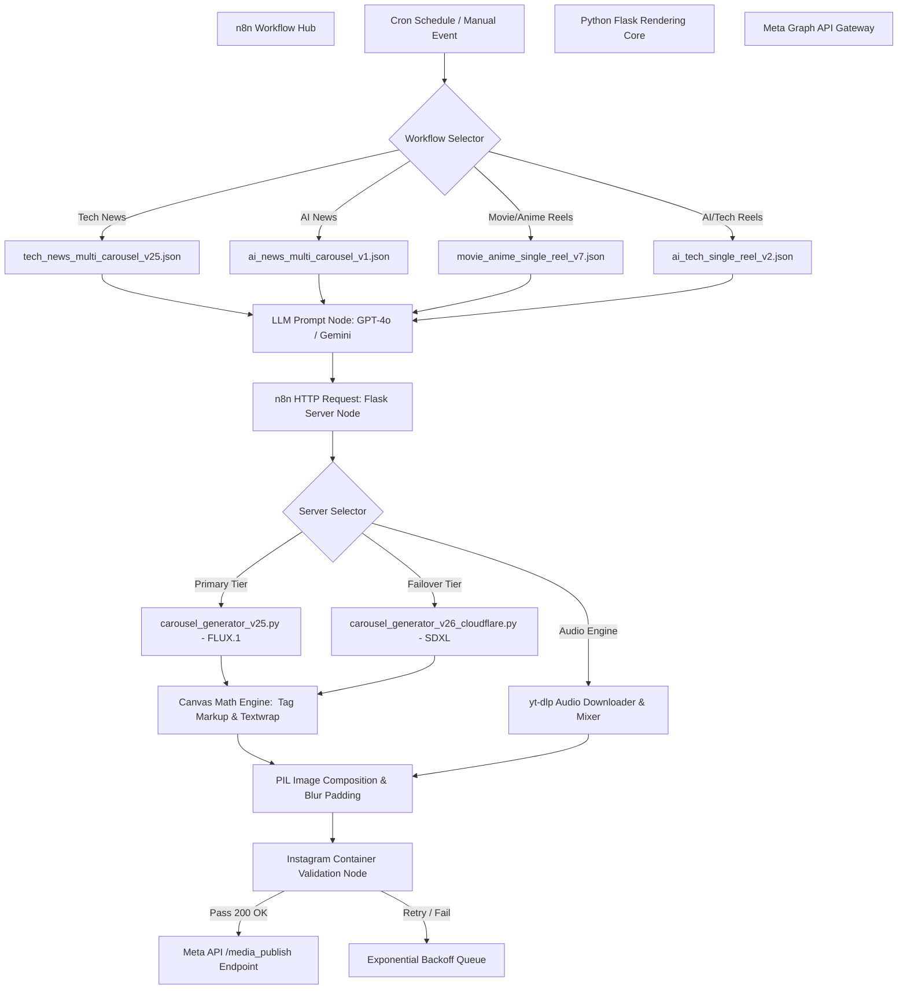

# AI Instagram Automation Pipeline (n8n + Python)

[](https://n8n.io/)
[](https://www.python.org/)
[](https://flask.palletsprojects.com/)
[](https://huggingface.co/black-forest-labs/FLUX.1-schnell)
[](https://developers.cloudflare.com/workers-ai/)
[](LICENSE)

> An production-grade, event-driven content generation pipeline that automatically scrapes live news feeds, generates AI images (FLUX.1 / Cloudflare SDXL), performs dynamic canvas text-wrapping with inline `<c>` color markup, mixes copyright-free background audio via `yt-dlp`, and publishes directly to Instagram Reels and Carousels via the **Instagram Graph API**.

---

## 📌 Table of Contents
- [Background & Problem Statement](#-background--problem-statement)
- [System Architecture & Workflow Hub](#-system-architecture--workflow-hub)
- [Core Features & Technical Depth](#-core-features--technical-depth)
- [Engineering Challenges & Solutions](#-engineering-challenges--solutions)
- [Repository Structure & Codebase Guide](#-repository-structure--codebase-guide)
- [Deep-Dive: Image Engines & Python Servers](#-deep-dive-image-engines--python-servers)
- [Getting Started & Installation](#-getting-started--installation)
- [API & Workflow Specifications](#-api--workflow-specifications)
- [Future Roadmap](#-future-roadmap)
- [License & Authors](#-license--authors)

---

## 🔍 Background & Problem Statement

Maintaining consistent engagement on social media platforms like Instagram requires publishing multi-slide carousels and dynamic reels on a daily basis.

### The Production Bottleneck
Traditional content creation relies on a cumbersome manual pipeline:
```
[1] News Feed Scraping ➔ [2] LLM Summarization ➔ [3] Prompt Engineering ➔ 
[4] Text Canvas Formatting ➔ [5] Audio Track Search & Mixing ➔ 
[6] Meta Container Generation ➔ [7] Pre-flight Payload Validation ➔ [8] Publishing
```

### Key Engineering Challenges Solved
1. **API Rate Limiting & Model Cold Starts**: HuggingFace inference endpoints experience HTTP 503 cold starts and strict rate limits during peak usage.
2. **Dynamic Canvas Text Wrapping**: Standard PIL/Pillow libraries lack native rich-text markup, causing long headers to overflow or overlap on generated image backgrounds.
3. **Instagram Payload Strictness**: Meta's Graph API rejects media containers instantly if image aspect ratios or HTTP headers deviate from standard guidelines (4:5 / 9:16).
4. **Automated Audio Synchronization**: Sourcing, trimming, and background audio mixing for single-reel videos without licensing issues.

---

## 🏗️ System Architecture & Workflow Hub

The platform uses a decoupled microservices pattern: **n8n** manages scheduling, state orchestration, and LLM text generation, while custom **Flask Python microservices** execute async image rendering, canvas math calculations, and `yt-dlp` audio downloading.



---

## ✨ Core Features & Technical Depth

### 1. Multi-Slide Carousel Workflows (`/workflows`)
* **`tech_news_multi_carousel_v25.json`**: Pulls top 10 daily Tech News stories, passes payload to GPT-4o for structured JSON extraction, generates high-res cinematic background images, and renders multi-slide carousel assets.
* **`ai_news_multi_carousel_v1.json`**: Dedicated AI updates pipeline filtered for targeted industry announcements (OpenAI, Anthropic, DeepSeek, Google DeepMind).

### 2. Single-Reel High-Impact Workflows (`/workflows`)
* **`movie_anime_single_reel_v7.json`**: Uses a mathematical bounding shuffle algorithm to randomly select top trending pop-culture/anime updates. Produces IGN-style hook frames with dual-colored subtitle overlays.
* **`ai_tech_single_reel_v2.json`**: Generates high-impact short video reels with dynamically injected circuit/tech aesthetic background imagery.

### 3. Rich-Text `<c>` Markup Engine
Custom PIL rendering engine in Python that parses custom inline XML tags `<c>highlighted text</c>` to render glowing accent headers, dual-colored subtitles, and background drop-shadows dynamically.

### 4. Automated Audio Mixing via `yt-dlp`
Randomly selects copyright-free aesthetic background tracks (e.g., *Memory Reboot*, *Snowfall*, *Resonance*, *Metamorphosis*), downloads them on-the-fly via `yt-dlp`, and mixes audio levels automatically with video tracks.

---

## 🛠️ Engineering Challenges & Solutions

### Challenge 1: HuggingFace 503 Model Loading & Quota Exhaustion
* **Problem**: HuggingFace's `FLUX.1-schnell` inference endpoint frequently returns HTTP 503 when the model cold-starts, or HTTP 429 when quota is exceeded.
* **Solution**: Implemented a **Multi-Tier Rendering Architecture**:
  * **Primary (`carousel_generator_v25.py`)**: 4-step retry loop with exponential sleep on 503 errors.
  * **Failover (`carousel_generator_v26_cloudflare.py`)**: Bypasses HuggingFace entirely by routing requests to Cloudflare Workers AI (`@cf/stabilityai/stable-diffusion-xl-base-1.0`).
  * **Fallback**: Unsplash API image fallback if cloud generation endpoints remain unreachable.

### Challenge 2: Dynamic Multiline Text Wrapping without Overlap
* **Problem**: Standard text wrapping breaks when mixing variable font sizes, glowing headers, and subtext wrappers on static 1080x1350 canvas resolutions.
* **Solution**: Built an algorithmic text-measurement loop in Python (`wrap_rich_text`) using `PIL.ImageDraw.textlength` that pre-calculates exact pixel widths per token before drawing lines.

### Challenge 3: Graph API Container Rate Limits & 400 Bad Request Errors
* **Problem**: Publishing media containers to Instagram immediately after creation causes `400 Invalid Payload` errors due to background Meta processing delays.
* **Solution**: Configured calibrated **n8n Wait-States** and HTTP polling verification loops to confirm media container readiness (`STATUS_CODE: FINISHED`) prior to triggering `/media_publish`.

---

## 📁 Repository Structure & Codebase Guide

```
AI-instagram-automation-n8n/
├── README.md                           # Project documentation
├── .gitignore                          # Git ignore definition
├── workflows/                          # Exported n8n visual workflows
│   ├── tech_news_multi_carousel_v25.json  # Tech News Multi-Slide Pipeline (v25)
│   ├── ai_news_multi_carousel_v1.json     # AI News Multi-Slide Pipeline (v1)
│   ├── movie_anime_single_reel_v7.json    # Movie & Anime Single-Reel Engine (v7)
│   └── ai_tech_single_reel_v2.json        # AI & Tech Single-Reel Engine (v2)
│
└── scripts/                            # Python Flask microservices
    ├── carousel_generator_v24.py       # Asynchronous array renderer & yt-dlp audio mixer
    ├── carousel_generator_v25.py       # HuggingFace FLUX.1-schnell engine + rich-text markup
    └── carousel_generator_v26_cloudflare.py # Cloudflare SDXL failover engine
```

---

## 💻 Deep-Dive: Image Engines & Python Servers

### Python Microservice Comparison

| Server Script | Image Model Provider | Primary Use Case | Key Features |
| :--- | :--- | :--- | :--- |
| **`carousel_generator_v24.py`** | Multi-Source Async | Base Media Pipeline | Async thread pooling, `yt-dlp` YouTube audio downloading & mixing. |
| **`carousel_generator_v25.py`** | HuggingFace (`FLUX.1-schnell`) | High-Quality Generation | Custom font loader (`Roboto-Black`), `<c>` rich-text markup parser, 4-step retry loop. |
| **`carousel_generator_v26_cloudflare.py`** | Cloudflare Workers AI (`SDXL`) | Production Failover | Ultra-fast Cloudflare infrastructure, fallback server bypassing HuggingFace limits. |

---

## 🚀 Getting Started & Installation

### Prerequisites
- **Python 3.10+**
- **n8n** (Self-hosted or Cloud instance)
- **`ffmpeg`** & **`yt-dlp`** installed on host machine (required for audio/video rendering).
- API Keys: HuggingFace Token, Cloudflare Workers AI credentials, OpenRouter / OpenAI API key, Meta Access Token.

### Installation

1. **Clone the Repository**:
   ```bash
   git clone https://github.com/Rana3112/AI-instagram-automation-n8n.git
   cd AI-instagram-automation-n8n
   ```

2. **Install Python Dependencies**:
   ```bash
   pip install flask pillow requests yt-dlp
   ```

3. **Boot Desired Rendering Engine**:
   - For HuggingFace FLUX.1 Engine:
     ```bash
     python scripts/carousel_generator_v25.py
     ```
   - For Cloudflare SDXL Failover Engine:
     ```bash
     python scripts/carousel_generator_v26_cloudflare.py
     ```

4. **Configure n8n Canvas**:
   - Open n8n (`http://localhost:5678`).
   - Import any JSON workflow from the `workflows/` directory.
   - Update HTTP Request nodes with your local Flask server endpoint (`http://localhost:5000/generate`).
   - Add your Meta Developer credentials and execute.

---

## 🔮 Future Roadmap

- [ ] **Multi-Platform Publishing**: Extending HTTP publishing adapters to **LinkedIn**, **Twitter/X**, and **TikTok**.
- [ ] **Telegram Approval Webhook**: Interactive Telegram bot node for one-click manual post preview and approval.
- [ ] **Analytics Tracking Dashboard**: Automated fetching of engagement metrics via Meta Insights API.

---

## 📜 License & Authors

Distributed under the **MIT License**.

Maintained by **[Utkarsh Rana](https://github.com/Rana3112)** — CS Undergraduate @ IIIT Vadodara.
